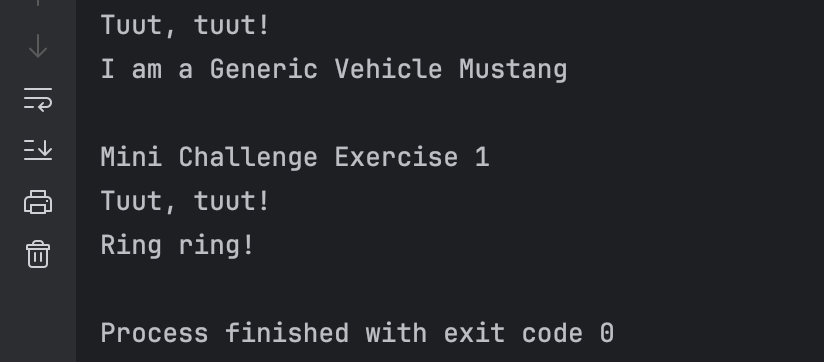
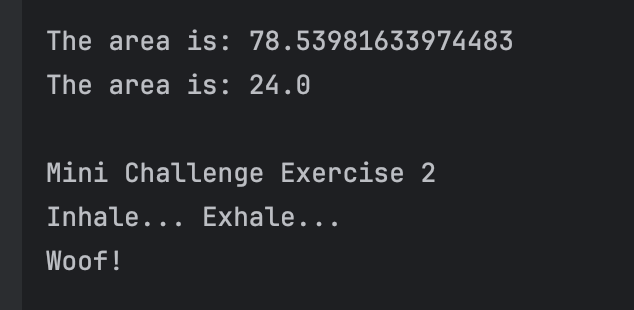
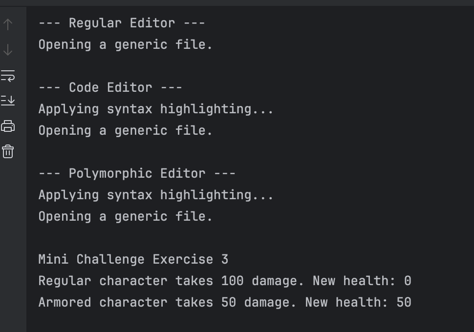

# The Power of Inheritance
**Name:** Andre Dominic Ha Lacra

---

## Output Screenshots and Mini Challenges

---

### 1. Basic Inheritance: The `extends` Keyword

**Output Screenshot:**  

---

### 2. Abstract Classes: Defining a Template

**Output Screenshot:**  

---

### 3. Method Overriding: Providing a New Implementation

**Output Screenshot:**  

---

### 4. Inheriting Variables & Access Rules

**Output Screenshot:**  

---
